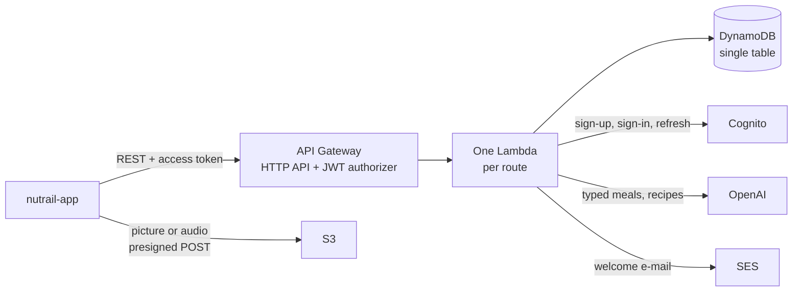
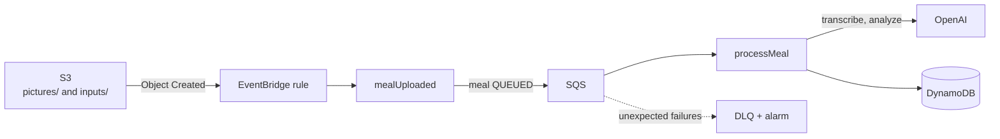
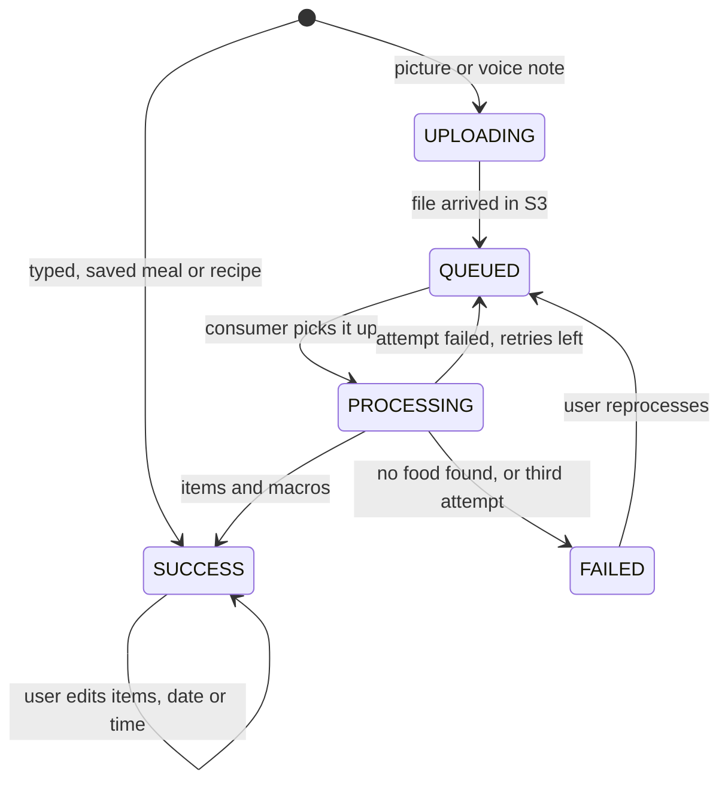

# Nutrail API


Backend of **Nutrail**, an AI-first food diary: the user logs a meal by taking a picture, recording a
voice note or typing what they ate, and gets back the foods with calories, protein, carbohydrate and
fat, measured against daily goals calculated from their profile. It also suggests a recipe from
what is left in the fridge.

| Repository | What it is |
|---|---|
| **nutrail-api** (this one) | Serverless REST API, meal processing pipeline and AI integration on AWS |
| [nutrail-app](https://github.com/pedrohdionisio/nutrail-app) | React Native (Expo) app |
| [nutrail](https://github.com/pedrohdionisio/nutrail) | The product overview |

## Contents

- [Highlights](#highlights)
- [System overview](#system-overview)
- [Meal lifecycle](#meal-lifecycle)
- [Engineering decisions](#engineering-decisions)
- [See it run in two commands](#see-it-run-in-two-commands)
- [Deploying](#deploying)
- [Tests](#tests)
- [Project layout](#project-layout)
- [Stack](#stack)

## Highlights

- **100% serverless and pay-per-use.** 28 routes on API Gateway HTTP API, each one its own Lambda,
  plus an S3 event handler, a queue consumer and a Cognito trigger. Nothing runs while nobody uses
  the app.
- **Three ways in, one result.** A picture, a voice note or a typed description all end as the same
  meal: a list of items, each with its own macros, and totals always derived from the items.
- **An asynchronous pipeline that survives failure.** Files go straight to S3 with a presigned POST;
  an EventBridge rule queues the meal on SQS; a consumer transcribes and analyzes it with retries, a
  dead-letter queue and a CloudWatch alarm. A failed meal can be reprocessed without re-uploading.
- **Structured AI output.** Every OpenAI call uses Structured Outputs validated by a Zod schema, so
  a response is either a well-formed meal or a clean `502` the app can retry.
- **Clean architecture with dependency inversion.** Use cases depend only on ports; DynamoDB, S3,
  SQS, Cognito, SES and OpenAI live behind adapters wired by a small DI container of its own.
- **Goals from science, kept consistent.** Mifflin-St Jeor for the basal rate, an activity factor
  and the goal on top; edited goals keep calories and macros in step.
- **Monitoring inside the free tier.** Five CloudWatch alarms per stage cover every HTTP 5xx, the
  asynchronous Lambdas and the dead-letter queue, notifying by e-mail through SNS.

## System overview

What happens during a request:



What happens after a picture or a voice note is uploaded:



The app polls the meal until it is analyzed. Typed meals, recipe suggestions and the analysis of a
single edited item are synchronous: they answer within the 30 seconds of the HTTP API.

## Meal lifecycle

Every transition is a method of the `Meal` entity, which refuses the ones that are not allowed.



A meal that never finished uploading is left out of the day. A meal that is deleted while it is
being processed is not recreated: every write of the pipeline requires the item to still exist.

## Engineering decisions

The full reasoning, with the data model and every flow, is in
[`docs/ARCHITECTURE.md`](docs/ARCHITECTURE.md) (in Portuguese). The short version:

| Decision | Why |
|---|---|
| **DynamoDB single table** keyed by user | Every read the app makes is one `GetItem` or one `Query`: profile and goals in one item, the meals of a day in one index partition, recipes and saved meals under the user. Deleting an account is deleting one partition. |
| **Internal user id, resolved from the Cognito `sub`** | The access token only carries the `sub`. The HTTP adapter resolves it through an index, with an in-memory cache and a short retry for the eventually consistent index right after sign-up. Custom token claims would need a paid Cognito tier. |
| **Upload to S3, then EventBridge, then SQS** | The app never streams files through a Lambda. A native S3 notification would create a CloudFormation cycle; EventBridge filters by prefix and keeps the bucket unaware of the function. |
| **The client resends the accepted recipe** | A suggestion is not stored until the user accepts it, so there are no drafts to clean up. The macros come back from the client, which is acceptable because the data belongs to that same user. |
| **Macros of an edited item** recalculated by the app, or by the AI only when needed | Changing only the quantity is a rule of three on the device. A new food or a new unit goes through a synchronous analysis endpoint that stores nothing. |
| **A small DI container** instead of a library | Constructor-keyed bindings with explicit scopes, a check that a singleton never captures a transient, and validation of the whole graph at cold start. Keys are constructors, because esbuild minifies class names. |
| **Sign-up as a saga** | Creating the Cognito user and writing the profile are two systems; if the second fails, the compensation deletes the first, so there is never an account without a profile. |

## See it run in two commands

You do not need an AWS account or an OpenAI key to see the API working. With **Node.js 24** and
**pnpm**:

```bash
pnpm install
pnpm test
```

The feature suite invokes the real Lambda handlers, through the real HTTP adapter and DI container,
for every route and for the S3 and SQS events, with DynamoDB, S3, SQS, Cognito, SES and OpenAI
replaced by in-memory fakes.

## Deploying

The API runs on real AWS resources provisioned by the Serverless Framework.

```bash
pnpm install
cp .env.example .env    # OPENAI_API_KEY and ALERT_EMAIL
pnpm run deploy         # stage dev; pnpm run deploy --stage prod for production
```

- The sender in `EMAIL_FROM` (`serverless.yml`) must be a verified SES identity, or the welcome
  e-mail is not sent. Sign-up does not fail because of it.
- AWS sends a confirmation link to `ALERT_EMAIL`; the alarms only reach you after it is confirmed.
- `pnpm upload:meal [file]` signs in with `TEST_USER_EMAIL` and `TEST_USER_PASSWORD` against
  `BASE_URL`, uploads a picture or a voice note and polls until the meal is analyzed — a smoke test
  of the whole pipeline on a deployed stage.

| Script | What it does |
|---|---|
| `pnpm run deploy` | Deploy the stack (`pnpm deploy`, without `run`, is a different pnpm command) |
| `pnpm upload:meal` | Smoke test the meal pipeline on a deployed stage |
| `pnpm dev:email` | Preview the e-mail templates |
| `pnpm lint` · `pnpm lint:fix` | Biome |
| `pnpm typecheck` | `tsc` |
| `pnpm test` · `test:watch` · `test:coverage` | Vitest |

## Tests

| Suite | What it covers |
|---|---|
| `tests/domain` | The `Meal` state machine, derived totals, saving and logging saved meals, the goal calculator and the macro math |
| `tests/application` | Every use case with in-memory fakes, asserting the final state: what was stored, queued, deleted or e-mailed |
| `tests/main/functions` | Every Lambda handler end to end through the HTTP, S3 and SQS adapters: status codes, error codes and validation |
| `tests/infra` | Each adapter against a mocked AWS SDK client or OpenAI client: the keys, indexes and conditions sent, and how responses and errors are mapped |
| `tests/kernel`, `tests/main` | The DI container rules and every port resolving to its implementation |

Time and ids are fixed in tests, so every assertion compares exact values.

## Project layout

```
src/
  domain/         entities with their rules, value objects, the goal calculator, domain errors
  application/    ports, one use case per operation, the saga, application errors
  infra/          DynamoDB, S3, SQS, Cognito, SES (React Email templates) and OpenAI (prompts)
  presentation/   controllers and Zod schemas, the S3 event handler, the queue consumer
  main/           DI bindings, Lambda adapters and one-line handlers
  kernel/         the DI container and decorators
  shared/config/  environment
sls/
  functions/      one file per Lambda
  resources/      DynamoDB, S3, SQS, Cognito, CloudWatch alarms
tests/            mirrors src/, plus support/ with fakes and fixtures
docs/
  ARCHITECTURE.md data model, flows, endpoints and decisions
```

The product is built for the Brazilian market, so e-mails and the meals the AI names are in
Portuguese by default. Error messages, identifiers and this README are in English; the app shows
its own Portuguese message for each error code.

## Stack

Node.js 24 · TypeScript · Zod · ULID · AWS Lambda, API Gateway, DynamoDB, S3, EventBridge, SQS,
Cognito, SES, CloudWatch and SNS · Serverless Framework v4 · esbuild + SWC · OpenAI · React Email ·
Vitest · aws-sdk-client-mock · Biome · pnpm

## Author

**Pedro Henrique Dionisio** — [LinkedIn](https://www.linkedin.com/in/pedrohenriquedionisio/)
